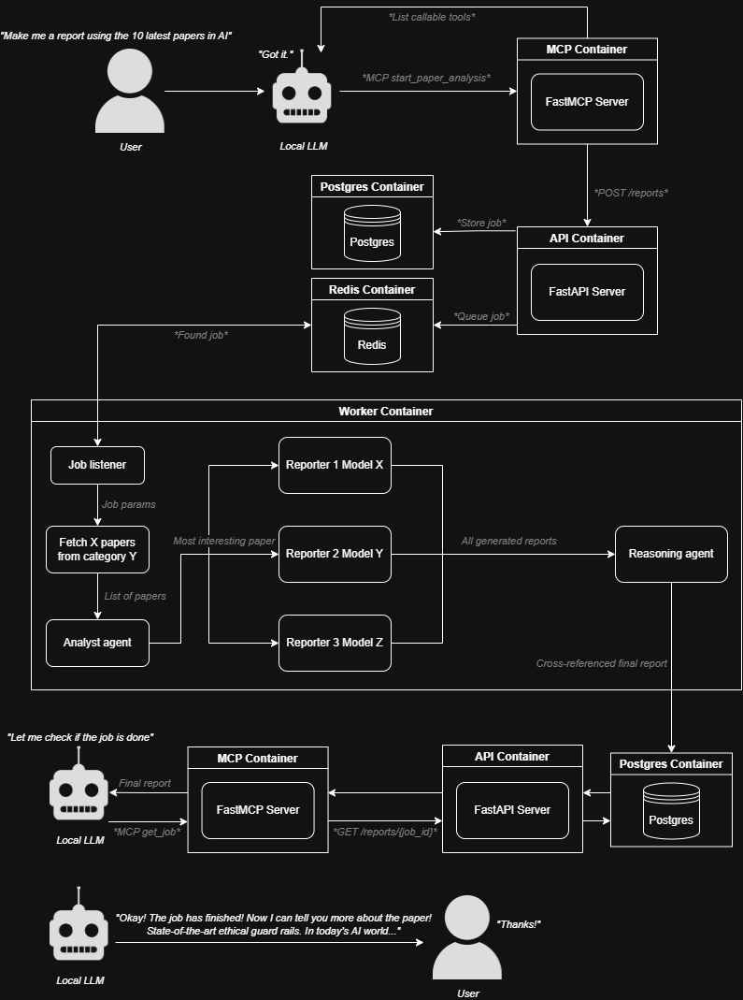
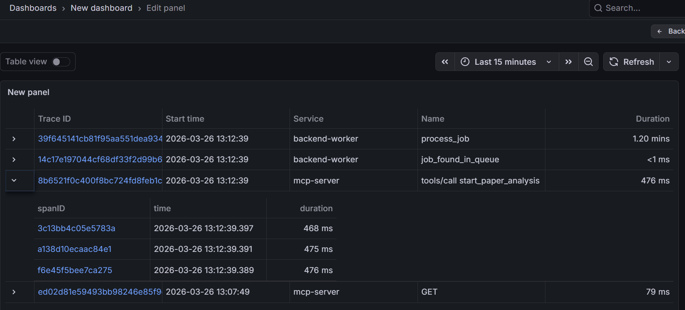
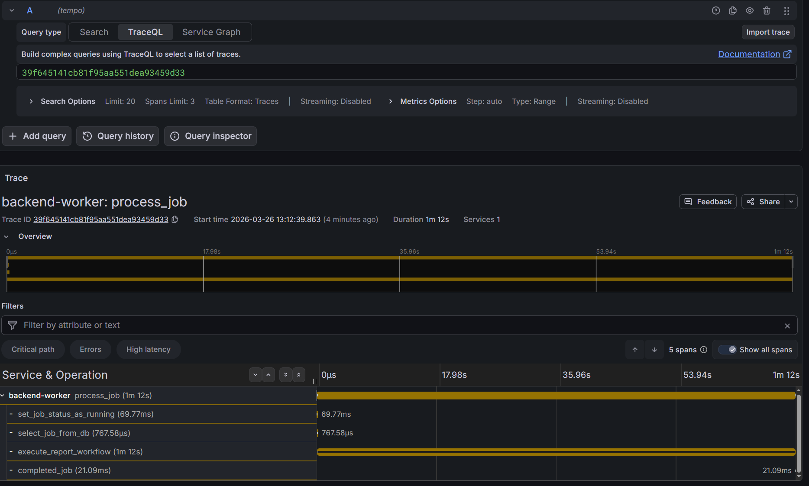

# Scientific AI Paper Reporting Agents
A lot of inspiration for this project was taken from past literature I've read ([find them here](https://github.com/djenkivanov)) and specifically from this [arXiv paper](https://arxiv.org/abs/2512.08769).  

The goal of this project is to implement best practices that are commony used in production environments across different industries that integrate Agentic AI.

## Main workflow
The main workflow consists of the following steps:
- The latest X (defualt 5) papers in category Y (default cs.AI) get fetched from ArXiv.
- Fetched papers get analyzed, and the most interesting is chosen based on certain factors (e.g. novelty, authors, impact on field) and returned for further analysis.
- Chosen paper gets analyzed by different models, in order to reduce bias and mistakes, and each model generates a report on the paper, including key points, insights, and implications.
- Finally, a reasoning agent compares every report generated by the different models and ensures consistency by cross-referencing important insights and points.

In the end, thanks to our reasoning agent we're left with an accurate, compact, and hallucination-free scientific report on the original paper. Using different AI models significantly improves the end result, given the fact that AI models have different strengths and weaknesses compared to each other. By cross-referencing their reports, we minimize the weaknesses while maximizing the strengths.

The pipeline is as follows:
- User asks local LLM for a report on papers.
- Local LLM makes a call to the MCP server.
- The MCP server makes a call to the backend API
- The backend API stores the job in Postgres and queues up the job in Redis
- An active listener receives the queued up job and starts executing the job, while updating the status of the job in the database during different stages.
- After 2-5 minutes (depending on models' compute times), the report will be generated and added to the job in the database.
- The local LLM can regularly make calls to get the job's status to check when it's done. When it's finished, the result is returned with the job, and the LLM can then use this result as context for its response.

For visual learners, here's a diagram with the complete pipeline from request to finish:



*Diagram created [here](https://app.diagrams.net/)*

## Tracing
Tracing has been implemented throughout different tasks on the MPC, API, and backend workers to keep enable deeper debugging capabilities.

Grafana/Alloy/Tempo was used alongside OpenTelemetry.

The tracing process is as follows:
- Create traces using OpenTelemetry.
- Alloy receives the traces data and sends it to Tempo.
- Tempo stores the traces.
- Grafana can query Tempo and display/visualize the traces data.

Here are some screenshots of my traces inside Grafana:
[]()
[]()

## Containerization
All services have been packaged neatly in a `docker-compose.yaml` and this current repository is perfectly reproducable on your system.

## Local deployment instructions
Create a `.env` file and create the following variables:
```
OPENAI_API_KEY=
NGROK_AUTHTOKEN=
POSTGRES_USER=
POSTGRES_PASSWORD=
POSTGRES_DB=
DB_URL=
```
Assign each variable's value correspondingly.

Ensure you have docker installed.  
After that just clone the repo and build the `docker-compose.yaml` file:  
```
docker-compose up --build
```
Use the Ngrok URL you're given in the container in your local LLM's MCP server config/json. 

If all your `.env` variables were correctly assigned, then asking the LLM to start an analysis on X papers in category Y should produce a tool call to the MCP server.

### *That's it!*

### Tech stack
- Python
- OpenAI Agents SDK
- Pydantic
- FastAPI
- FastMCP
- Ngrok
- LM Studio (Local LLMs)
- Docker
- OpenTelemetry
- Grafana/Alloy/Tempo


